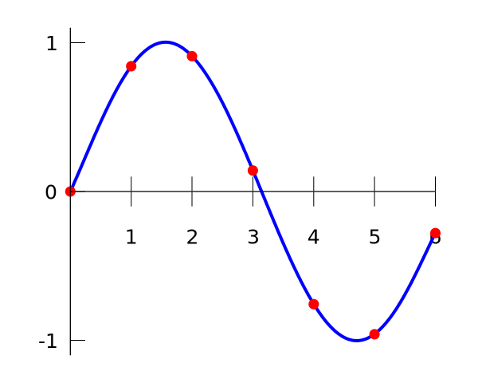

::: {.eyebrow}
guide
:::

```{r}
library(plant)
```

## Introduction

All models in plant take extrinsic drivers as inputs. At their simplest these are constants. Or they could be variables that change over time. The Extrinsic Drivers class is setup to enable verstaile input.

Extrinsic Drivers are configured as functions over time that are used as inputs in the `plant` solver (SCM). Due to the flexibility of the implementation, the functions can be set up as either constants or time-varying inputs. This document goes through examples of setting up Extrinsic Drivers throughout `plant`.

When handling functions that vary over time, Extrinsic Drivers are created via interpolation. Control points are passed as input, and the
system creates a smooth function that interpolates the control points:

[{width="400"}](https://en.wikipedia.org/wiki/Polynomial_interpolation)

## Rainfall

Rainfall is handled inside `TF24_Environment`, and is set upon construction. If nothing is passed to `make_environment`, rainfall
will default to a value of `1`:

```{r}
env <- Environment("TF24")
```

Otherwise, it can either be a constant:

```{r}
env <- Environment("TF24")
env$extrinsic_drivers_set_constant("rainfall", 3.14)
```

... or varying over time, by providing a list with `x` and `y` control points (ie the point pairs are `(x[i], y[i])`):

```{r}
x_pts <- seq(0, 200, 1)
rain <- list(
  x = x_pts,
  y = 1 + sin(x_pts)
)
env <- Environment("TF24")
env$extrinsic_drivers_set_variable("rainfall", rain$x, rain$y)
```

The resulting function of rainfall over time can then be evaluated at any time. Note how the point of evaluation was not one of the control points passed in - we
are able to get rainfall at time `5.634` because of the smooth interpolated function.

```{r}
env$extrinsic_drivers_evaluate("rainfall", 5.634)
```

We can also evaluate the function at a list of times, and get a list of rainfall values at those times as a result:

```{r}
env$extrinsic_drivers_evaluate_range("rainfall", c(5, 1.2, 78.345))
```

## Birth rates

Per species birth rates are set via the `expand_parameters()` function. Each object in the list is either a constant number or an embedded list with `x` and `y` control points. There must be the same number of items in the list as there are species:

```{r}
p0 <- scm_base_parameters("TF24")
p0$max_patch_lifetime <- 25      # short patch keeps the hydraulic solve fast

# two species
lmas <- trait_matrix(c(0.0825, 0.125), "lma")

x_pts <- seq(0, 200)
birth_rates <- list(
    species1 = list(x = x_pts, y = 1 + sin(x_pts)),
    species2 = 3.14
  )

p1 <- expand_parameters(lmas, p0, TF24_hyperpar,
          keep_existing_strategies = FALSE,
          birth_rate_list = birth_rates)

# TF24 needs a configured soil-water environment: layered soil with an initial
# moisture state and a rainfall driver whose mean stays above zero. A bare
# `Environment("TF24")` would halt with `psi_soil = nan`. See the
# [Example analysis](example-analysis.qmd) guide for the full recipe.
env <- Environment("TF24")
env$set_soil_number_of_depths(15)
env$set_soil_water_state(rep(0.2, 15))
rain_t <- seq(0, p0$max_patch_lifetime, length.out = 1000)
env$extrinsic_drivers_set_variable("rainfall", rain_t, 0.25 * sin(2 * pi * rain_t) + 1.0)

ctrl <- Control()
out <- run_scm(p1, env, ctrl)
```

Evaluating the birth rate can be done with the scm

```{r}
out$patch$species[[1]]$extrinsic_drivers$evaluate("birth_rate", 7)
```
