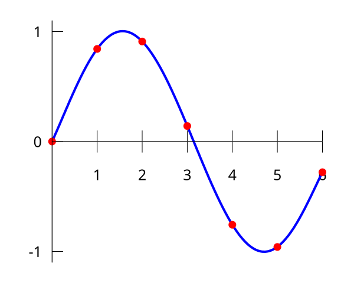

::: {.eyebrow}
guide
:::

```{r}
library(plant)
```

Environmental conditions and recruitment can change while a patch develops.
`plant` represents these outside inputs as **extrinsic drivers**: named
functions that return a value for any simulation time.

Use a constant driver when conditions remain fixed. Use a variable driver when
they change, supplying time (`x`) and value (`y`) control points from which
`plant` constructs a smooth interpolation:

[{width="400"}](https://en.wikipedia.org/wiki/Polynomial_interpolation)

Every driver—such as `"rainfall"`, `"ca"`, or `"birth_rate"`—uses this same
constant-or-spline interface. By default, a spline cannot be evaluated outside
the time range supplied by its control points. Make sure those points cover the
whole simulation unless you deliberately enable extrapolation.

## Rainfall

In TF24, rainfall supplies water to the soil balance and therefore affects the
leaf-level water economy and growth. A new TF24 environment provides a constant
rainfall driver with value `1`:

```{r}
env <- Environment("TF24")
```

Replace it with a different constant when rainfall is fixed:

```{r}
env <- Environment("TF24")
env$extrinsic_drivers_set_constant("rainfall", 3.14)
```

For changing rainfall, supply paired time and rainfall values. Between these
control points, the driver is interpolated smoothly:

```{r}
x_pts <- seq(0, 200, 1)
rain <- list(
  x = x_pts,
  y = 1 + sin(x_pts)
)
env <- Environment("TF24")
env$extrinsic_drivers_set_variable("rainfall", rain$x, rain$y)
```

The resulting driver can be evaluated at any time inside the supplied range.
The time `5.634` was not one of the control points, so this value comes from the
interpolation:

```{r}
env$extrinsic_drivers_evaluate("rainfall", 5.634)
```

We can also evaluate the function at a vector of times and get a numeric vector
of rainfall values:

```{r}
env$extrinsic_drivers_evaluate_range("rainfall", c(5, 1.2, 78.345))
```

## The full climate driver set

Rainfall is only one of the climate drivers used by
[TF24](../theory/models/tf24.qmd) and TF24f. You do not need to change all of
them; use this table to find the input relevant to your scenario.

| Driver         | Meaning                                    | TF24 default |
|----------------|---------------------------------------------|:-------------:|
| `PPFD`         | Photosynthetic photon flux density, i.e. light ($\mu$mol m$^{-2}$ s$^{-1}$) | `1800` |
| `rainfall`     | Rainfall, driving the soil-water balance    | `1` |
| `atm_vpd`      | Atmospheric vapour-pressure deficit (kPa)   | `1` |
| `ca`           | Atmospheric CO$_2$ partial pressure (Pa — so the default `40` is $\approx$ 400 ppm) | `40` |
| `leaf_temp`    | Leaf temperature ($^\circ$C)                | `25` |
| `atm_o2_kpa`   | Atmospheric O$_2$ partial pressure (kPa)    | `21` |
| `atm_kpa`      | Atmospheric pressure (kPa)                  | `100.5` |

`birth_rate` uses the same driver machinery but is set separately for each
species rather than on the environment.

Each of these is configured exactly the same way as `rainfall` above: a
constant with `extrinsic_drivers_set_constant()`, or a time-varying spline
with `extrinsic_drivers_set_variable()`. For example, to hold CO2 fixed at a
different concentration than the TF24 default:

```{r}
#| eval: false
env <- Environment("TF24")
env$extrinsic_drivers_set_constant("ca", 60)
```

To vary it through time, pass `x` and `y` control points just as for rainfall:

```{r}
#| eval: false
x_pts <- seq(0, 200, 1)
ca_ramp <- list(
  x = x_pts,
  y = 40 + 0.2 * x_pts   # a rising atmospheric CO2 trajectory
)
env <- Environment("TF24")
env$extrinsic_drivers_set_variable("ca", ca_ramp$x, ca_ramp$y)
env$extrinsic_drivers_evaluate("ca", 100)
```

Because every driver shares this same constant-or-spline mechanism, the same
recipe covers any climate-forced scenario: a steadily rising `ca` spline for
a CO2 ramp, a `rainfall` spline that dips and stays low for a drought pulse,
or a `leaf_temp` spline for a warming trajectory. For instance, a drought
pulse superimposed on an otherwise steady rainfall regime might look like:

```{r}
#| eval: false
x_pts <- seq(0, 200, 1)
drought_y <- ifelse(x_pts >= 80 & x_pts <= 120, 0.1, 1)
env <- Environment("TF24")
env$extrinsic_drivers_set_variable("rainfall", x_pts, drought_y)
```

Only the TF24 and TF24f strategies read these atmospheric and leaf drivers
(`atm_vpd`, `ca`, `leaf_temp`, `atm_o2_kpa`, `atm_kpa`) and couple them into
the leaf-level water economy described in
[Assimilation & hydraulics](../theory/assimilation-hydraulics.qmd). FF16 and
K93 instead use their canopy light profile; they do not read these TF24 climate
drivers. All strategies can receive the separate, per-species `birth_rate`
driver described below.

## Birth rates

A species' birth rate describes the seed rain entering each patch. In the
[size-structured PDE](../theory/size-structured-pde.qmd), it is the boundary
condition that introduces new plants.

Pass birth rates to `add_strategies()`. Each species needs one entry: either a
constant number or a list of `x` and `y` control points.

```{r}
p0 <- scm_base_parameters("TF24")
p0$max_patch_lifetime <- 25      # short patch keeps the hydraulic solve fast

# two species
lmas <- trait_matrix(c(0.0825, 0.125), "lma")

x_pts <- seq(0, 200)
birth_rates <- list(
    species1 = list(x = x_pts, y = 1 + sin(x_pts)),
    species2 = 3.14
  )

p1 <- add_strategies(p0, lmas, TF24_hyperpar,
          keep_existing = FALSE,
          birth_rate = birth_rates)

# Customise the default TF24 soil column and rainfall trajectory for this run.
env <- Environment("TF24")
env$set_soil_number_of_depths(15)
env$set_soil_water_state(rep(0.2, 15))
rain_t <- seq(0, p0$max_patch_lifetime, length.out = 1000)
env$extrinsic_drivers_set_variable("rainfall", rain_t, 0.25 * sin(2 * pi * rain_t) + 1.0)

ctrl <- Control()
out <- run_scm(p1, env, ctrl)
```

Inspecting the driver at a particular time is a useful check that the species
received the intended recruitment schedule:

```{r}
out$patch$species[[1]]$extrinsic_drivers$evaluate("birth_rate", 7)
```
