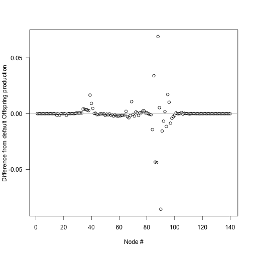
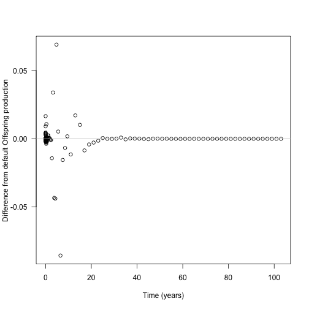
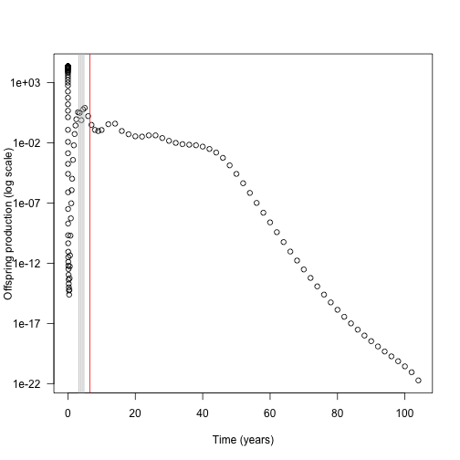
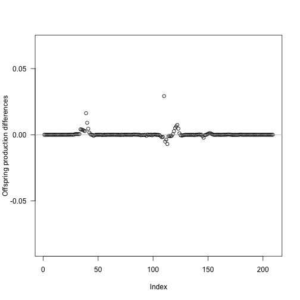

::: {.eyebrow}
implementation
:::

## Background

As described in the [size-structured PDE](../size-structured-pde.qmd) page,
the spacing of nodes can affect the accuracy of integration over the
size-density distribution. `plant` uses an adaptive algorithm to build an
appropriately spaced node schedule with the desired accuracy at every time
point, using as few nodes as possible.

The refinement algorithm takes an initial vector of introduction times and
considers, for each node, whether removing that node causes the error
introduced when integrating two specified functions over the size-density
distribution to jump over the allowable error threshold `schedule_eps`. This
calculation is repeated for every time step in the development of the
patch. A new node is introduced immediately prior to any node
failing these tests. The dynamics of the patch are
then simulated again and the process is repeated, until all integrations at
all time points have an error below the tolerable limit
`schedule_eps`. Decreasing `schedule_eps` demands higher
accuracy from the solver, and thus increases the number of nodes being
introduced. Note that we are assessing whether removing an existing node
causes the error to jump above the threshold limit, and using this to decide
whether an extra node -- in addition to the one used in the test --
should be introduced. Thus, the actual error is likely to
be lower than, but at most equal to, `schedule_eps`.

This refinement now lives entirely in C++, inside the `SCM` solver. You trigger
it from R with:

```r
scm <- run_scm(p, refine_schedule = TRUE)
p_refined <- scm$parameters
```

`run_scm(refine_schedule = TRUE)` calls `SCM::refine_schedule()`, which runs the
solver, collects the per-node integration error as the patch develops, splits
the flagged intervals, and repeats. The refined schedule and the ODE times of
the final run are written back into the returned `parameters`, so the
`Parameters` object remains self-describing. (Earlier versions of `plant` did
this work in R via the `build_schedule()` and `run_scm_error()` functions; both
have been removed in favour of the in-solver implementation.)

This page shows some details of node splitting, most of which happens
automatically. It's probably not very interesting to most people, only those
interested in knowing how the SCM technique works in detail.  It also uses a lot
of non-exported, non-documented functions from plant so you'll see
a lot of `plant:::` prefixes.

## Node introduction times

<!-- TODO(#481): elaborate on why concentrating early helps -->

The default node introduction times are designed to concentrate
node introductions onto earlier times, based on empirical
patterns of node refining:

```{r}
#| label: setup
library(plant)
library(parallel)
ncores <- detectCores() - 1

p0 <- scm_base_parameters("FF16")
p <- expand_parameters(trait_matrix(0.0825, "lma"), p0, birth_rate_list = 20)

times_default <- p$node_schedule_times[[1]]
```

```{r}
#| label: default-times
#| fig-cap: "Default node introduction times, concentrated onto earlier times."
plot(times_default, cex=.2, pch=19, ylab="Time (years)", las=1)
```

<!-- TODO(#481): explain how introducing two species together reduces work -->

The actual differences are stepped in order to increase the chance
that nodes from different species will be introduced at the same
time and reduce the total amount of work being done.

```{r}
#| label: time-differences
#| fig-cap: "Stepped differences between successive introduction times."
plot(diff(times_default), pch=19, cex=.2, ylab="Time difference (years)", las=1)
```

## Estimating error in node spacing

We can assess the impact of node spacing on integration error by examining
the cumulative offspring production of a patch.

Increasing the number of nodes is expected to increase integration accuracy
at the expense of more computational effort. We can create more refined schedules
by interleaving points into the existing schedule:

```{r}
#| label: interleaved-schedules
#| fig-cap: "Default schedule (black) interleaved to 2x (blue) and 4x (red) the nodes."
interleave <- function(x) {
  n <- length(x)
  xp <- c(x[-n] + diff(x) / 2, NA)
  c(rbind(x, xp))[- 2 * n]
}


times_2x <- interleave(times_default)
times_4x <- interleave(times_2x)

plot(times_default, xlab = "Node #", ylab="Time (years)",
     xlim = c(1, length(times_4x)), las=1, pch = 19, cex=.2,)
points(times_2x, pch=19, cex=.2, las=1, col = "blue")
points(times_4x, pch=19, cex=.2, las=1, col = "red")
```

Each schedule runs for the same duration, but `times_4x` has 4x as many nodes.
Running a patch with each node schedule allows us to compare the propagule
outputs:

```{r}
#| label: run-with-times
run_with_times <- function(p, t) {
  p$node_schedule_times[[1]] <- t

  start <- Sys.time()
  offspring_production <- run_scm(p)$offspring_production
  print(paste("Time to solve:", round(Sys.time() - start, 2)))

  return(offspring_production)
}

offspring_production_default <- run_with_times(p, times_default)
offspring_production_2x <- run_with_times(p, times_2x)
offspring_production_4x <- run_with_times(p, times_4x)

node_range <- c(length(times_default), length(times_2x),
                  length(times_4x))
offspring_production_range <- c(offspring_production_default, offspring_production_2x,
                     offspring_production_4x)
```

Quadrupling the number of nodes results in nearly a 6x increase in runtime,
eight times the nodes takes roughly 26x longer (the latter not shown).

```{r}
#| label: offspring-vs-nodes
#| fig-cap: "Offspring production saturates as node introductions become finer."
plot(x = node_range, y = offspring_production_range,
     xlab="Number of node introductions", ylab="Offspring production", las=1)
```

Offspring production increases as nodes are introduced more finely,
though at a saturating rate, meaning there are diminishing returns in accuracy
for additional nodes.

The differences in offspring production are not actually that striking
(perhaps
1%) but
the introduced  *variation* creates instabilities of sufficient concern.

## Individual offspring production contributions

Where is the fitness difference driving change in offspring production coming from?

Consider adding a *single* additional node at one of the points
along the first vector of times `times_default` and computing the
output offspring production:

The next chunk runs the solver once per insertion position in parallel via
`mclapply`. It is a heavy computation, so we mark it `#| eval: false` and show
the pre-rendered figure below; the helper definitions are retained for
reference.

```{r}
#| label: insert-differences-node
#| eval: false
insert_time <- function(i, x) {
  j <- seq_len(i)
  c(x[j], (x[i] + x[i+1])/2, x[-j])
}
run_with_insert <- function(i, p, t) {
  run_with_times(p, insert_time(i, t))
}

insert_positions <- seq_len(length(times_default) - 1)
offspring_productions <- unlist(mclapply(insert_positions, run_with_insert,
                              p, times_default, mc.cores = ncores))

offspring_production_differences <- offspring_productions - offspring_production_default

plot(insert_positions, offspring_production_differences,
     xlab="Node #", ylab="Difference from default Offspring production", las=1)
abline(h=0, col="grey")
```



The biggest deviations in output offspring production come about half way
through the schedule, though because of the compression of early times
this occurs fairly early in patch development:

The next chunk just replots the differences computed above against time, so it
is also marked `#| eval: false` and shown as a pre-rendered figure.

```{r}
#| label: insert-differences-time
#| eval: false
times_interpolated <- (times_default[-1L] +
                         times_default[-length(times_default)]) / 2

plot(times_interpolated, offspring_production_differences,
     xlab="Time (years)", ylab="Difference from default Offspring production", las=1)
abline(h=0, col="grey")
```



Now look at the contribution of different nodes to the overall patch output
(log scaled for clarity).

Each node carries its own lifetime offspring production, accumulated inside the
ODE and exposed per node via the species'
`net_reproduction_ratio_by_node`. (This is the unweighted per-node
contribution; the SCM weights these by the patch-age density and survival
during dispersal when integrating overall fitness.)

This chunk depends on `times_interpolated`, `top_5` and
`offspring_production_differences` produced by the parallel chunks above, so it
is shown as a pre-rendered figure rather than executed.

```{r}
#| label: node-contributions
#| eval: false
default <- run_scm(p)

contributions <- default$patch$species[[1]]$net_reproduction_ratio_by_node

top_5 <- order(abs(offspring_production_differences), decreasing=TRUE)[1:5]

# drop the first node (zero contribution) to avoid log(0)
keep <- contributions > 0
plot(times_default[keep], contributions[keep], log = "y",
     xlab="Time (years)", ylab="Offspring production (log scale)", las=1)
abline(v=times_interpolated[top_5], col=c("red", rep("grey", 4)))
```



<!-- TODO(#481): there might be a clearer way to summarise this point -->

In this case almost all the contribution comes from early nodes
(this is essentially a single-age stand of pioneers).

Overlaid on this are the five nodes where extra refinement
(i.e. inserting an additional node) causes the largest
change in overall offspring production output (biggest difference in red).

The difference is not coming from offspring production contributions of those
nodes, which is basically zero, though it is higher than the
surrounding nodes.

## Individual competitive impacts

If the inserted nodes are not altering offspring production through individual
contributions, they may be altering the output of neighbouring nodes
through competitive interactions.

Here we investigate the differences in patch light environment after
introducing the single node driving the greatest difference in seed output
identified above.

First we run patches with and without the extra node, collecting the complete
set of patch conditions at each timestep with `run_scm(collect = TRUE)`.

This chunk depends on `top_5` and `insert_time()` from the parallel analysis
above, so it is shown but not executed.

```{r}
#| label: collect-with-times
#| eval: false
collect_with_times <- function(p, t) {
  p$node_schedule_times[[1]] <- t
  result <- run_scm(p, collect = TRUE)
  return(result)
}

insert_position <- top_5[1]
times_insert <- insert_time(insert_position, times_default)

results_default <- collect_with_times(p, times_default)
results_insert <- collect_with_times(p, times_insert)
```

In order to make a direct comparison, we need to interpolate the light
environment over a common set of heights at each time step.

We reconstruct the light environment spline for both runs, and compute light_availability in both:

```{r}
#| label: interpolate-light
#| eval: false
interpolated_light_availability <- function(env, heights) {
  # intialise new spline with existing values
  spline <- plant:::Interpolator()
  spline$init(env[, 1], env[, 2])

  # subset to valid heights in patch
  patch_heights <- heights < spline$max

  # evaluate over list of heights and zero
  y <- spline$eval(heights)
  y[!patch_heights] = 0

  return(y)
}

n = length(results_default$time)

max_height <- max(results_default$env[[n]][, 1],
                  results_insert$env[[n+1]][, 1])

heights <- seq(0, max_height, length.out=201)
light_availability_spline_default <- sapply(results_default$env, interpolated_light_availability, heights)
light_availability_spline_insert <- sapply(results_insert$env, interpolated_light_availability, heights)

light_availability_spline_difference <- t(light_availability_spline_insert[, -(insert_position + 1)] - canopy_default)
light_availability_spline_difference[abs(light_availability_spline_difference) < 1e-10] <- NA
```

Taking the difference between light environments at each height and timestep,
the resulting image plot is blue in regions where the refined light environment,
with the additional node is lighter (higher light_availability)
and red in regions where the the light environment is darker with the additional
node.

This image plot depends on the snapshots collected above, so it is shown but not
executed. (The source did not pre-render this figure.)

```{r}
#| label: light-difference-image
#| eval: false
# ColorBrewer's RdBu palette
cols <- c("#B2182B", "#D6604D", "#F4A582", "#FDDBC7",
          "#D1E5F0", "#92C5DE", "#4393C3", "#2166AC")
pal <- colorRampPalette(cols)(20)

image(results_default$time, heights, light_availability_spline_difference,
      xlab="Time (years)", ylab="Height (m)", las=1, col=pal)
```

Shading is lower for ~7 m tall nodes at year 25. This increased competitive intensity
may be driving differences in offspring production.

## Monitoring integration accuracy

<!-- TODO(#481): find more general terms for 'leaf-area error' -->

The SCM monitors two integrations over the size-density distribution as the
patch develops and uses the larger of the two errors to decide where to refine:

- a **competition (leaf-area) error**, measuring how much removing a node
  changes the estimate of total leaf area in the patch; and
- an **offspring-production error**, measuring how much removing a node changes
  the estimate of total seed production from the patch.

The relative error of each integration is computed with the
`local_error_integration` function. The competition error is sampled at every
introduction step as the patch develops, while the offspring-production error is
computed once at the end of the run. Both are now accumulated *inside*
`SCM::run()` when error collection is enabled, and the per-node maximum of the
two is exposed as `refinement_error_by_node` -- the signal that drives refinement:

```{r}
#| label: combined-error
#| fig-cap: "Combined per-node error; nodes above the schedule_eps threshold (red) are split."
scm <- run_scm(p)            # SCM object
scm$collect_refinement_errors <- TRUE
scm$run()                    # rerun, now accumulating the error signal

combined <- scm$refinement_error_by_node[[1]]

plot(times_default, combined, type = "h",
     xlab = "Introduction time (years)", ylab = "Combined per-node error", las = 1)
abline(h = Control()$schedule_eps, col = "red", lty = 2)
```

Nodes whose combined error exceeds the threshold `schedule_eps` (red line) are
the ones the refinement step will split.

To see how the competition error builds up over the development of the patch we
can reconstruct the per-step matrix that the solver accumulates internally. We
run the SCM once collecting a patch snapshot after each introduction, then
recompute the competition error from each snapshot. Each row is one introduction
step; each column is a node:

```{r}
#| label: competition-error-matrix
#| fig-cap: "Per-step competition (leaf-area) error matrix as the patch develops."
competition_error_matrix <- function(p, env = NULL, ctrl = Control()) {
  scm <- run_scm(p, env, ctrl)   # build + run, returns the SCM object
  scm$reset()                    # rewind so we can re-run while collecting
  scm$collect <- TRUE
  scm$run()

  ## history[[1]] is the initial (empty) patch; the rest are the state after
  ## each introduction. Recompute species 1's per-node competition error.
  rows <- lapply(scm$history[-1], function(h)
    h$species[[1]]$compute_competition_effect_by_nodes_error(h$compute_competition(0)))
  ncol <- max(lengths(rows))
  do.call(rbind, lapply(rows, function(r) c(r, rep(NA, ncol - length(r)))))
}

patch_error_lai <- competition_error_matrix(p)
image(times_default, times_default, patch_error_lai,
      xlab="Patch age (years)", ylab="Introduction time (years)", las=1)
```

`SCM::refine_schedule()` uses exactly this combined error to find an
appropriately refined node spacing that minimises both integration errors.

```{r}
#| label: refine-schedule
scm_refined <- run_scm(p, refine_schedule = TRUE)
p_refined <- scm_refined$parameters
offspring_production_refined <- scm_refined$offspring_production
```

We can see the impact of this refinement by repeating our earlier analysis --
inserting a new node at each timestep and extracting the offspring production --
this time plotting on the *same* vertical scale as the unrefined run above:

This final analysis again runs the solver once per insertion position via
`mclapply` (and depends on `offspring_production_differences` from the earlier
parallel run), so it is marked `#| eval: false` and shown as a pre-rendered
figure.

```{r}
#| label: refined-differences
#| eval: false
times_refined <- p_refined$node_schedule_times[[1]]

insert_positions <- seq_len(length(times_refined) - 1)

offspring_productions_refined <- unlist(mclapply(insert_positions, run_with_insert,
                                      p_refined, times_refined,
                                      mc.cores = ncores))

refined_differences <- offspring_productions_refined - offspring_production_refined

plot(insert_positions, refined_differences,
     xlab = "Index", ylab = "Offspring production differences", las = 1,
     ylim = range(offspring_production_differences))
abline(h = 0, col = "grey")
```



On this common scale it is clear that refinement noticeably shrinks the
variation introduced by inserting an extra node. In relative terms the largest
remaining change is only
0.0017.
The refined node introduction schedule reaches an offspring production near the
saturating value identified above, but with 210
nodes rather than the 561 nodes used in naive interpolation.
