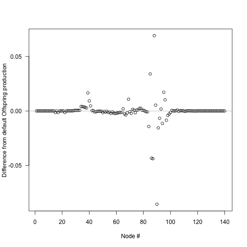
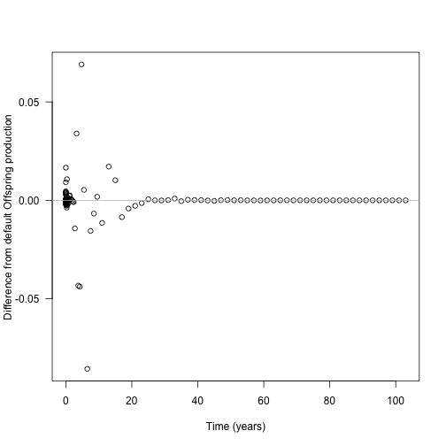
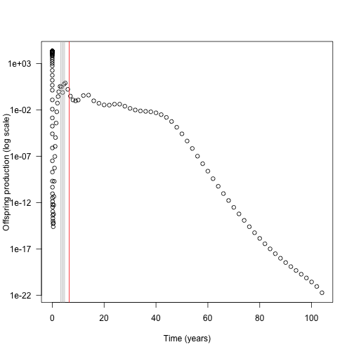
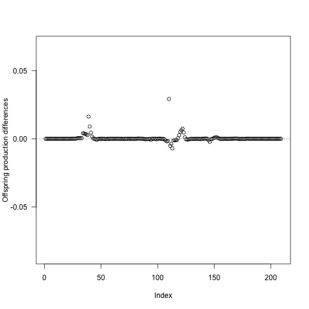

::: {.eyebrow}
implementation
:::

::: {.callout-note}
## Prerequisites
This page builds on [The size-structured PDE](../size-structured-pde.qmd) and
[the method of characteristics](characteristic-method.qmd). Read those first if
the notation here is unfamiliar.
:::

## The idea first

`plant` never tracks a continuous size distribution directly. Instead, it uses
a finite collection of cohorts. Each cohort contains one representative
individual that stands in for all plants born at roughly the same time. As the
cohorts grow and thin, the model must decide when to add a new one and how to
space them so that the collection still represents the size distribution
faithfully.

This creates a genuine trade-off. Too few or too widely spaced cohorts smooth
over population structure that matters for growth and competition. Too many
cohorts spend computation refining parts of the distribution that were already
accurate enough. The node-spacing algorithm aims to use the smallest set that
keeps approximation error below a chosen tolerance throughout patch
development.

The rest of this page makes this precise.

## Background

As explained on [The size-structured PDE](../size-structured-pde.qmd), the SCM
replaces a continuous size distribution with discrete nodes. Integrals over the
size distribution are therefore approximations, and their accuracy depends on
how closely those nodes are spaced. `plant` adapts the spacing to reach a chosen
accuracy while avoiding nodes that contribute little useful information.

The algorithm begins with a schedule of node introduction times. For each node,
it asks a practical question: if this node were removed, would either of two
important population integrals become too inaccurate? The allowable relative
error is set by `schedule_eps`. The solver performs this test throughout patch
development, inserts a new node just before any interval that fails, and then
simulates the patch again. It repeats the cycle until both integrals remain
within the tolerance at every time point.

A smaller `schedule_eps` requires greater accuracy and usually leads to more
nodes. The test is deliberately conservative: it measures the error caused by
*removing* an existing node, then responds by adding another node nearby. The
error in the final, refined schedule will therefore usually be below the stated
tolerance.

This refinement now lives entirely in C++, inside the `SCM` solver. You trigger
it from R with:

```r
scm <- run_scm(p, refine_schedule = TRUE)
p_refined <- scm$parameters
```

`run_scm(refine_schedule = TRUE)` calls `SCM::refine_schedule()`, which runs the
solver, collects the per-node integration error as the patch develops, splits
the flagged intervals, and repeats. The refined schedule and the ODE times of
the final run are written back into the returned `parameters`, so the
`Parameters` object remains self-describing. (Earlier versions of `plant` did
this work in R via the `build_schedule()` and `run_scm_error()` functions; both
have been removed in favour of the in-solver implementation.)

Most users can let this refinement happen automatically. The examples below are
for readers who want to understand how the SCM chooses its nodes and how that
choice affects numerical accuracy. Some examples inspect non-exported `plant`
internals, which is why they use the `plant:::` prefix. Those interfaces are
implementation details rather than part of the stable user API.

## Node introduction times

<!-- TODO(#481): elaborate on why concentrating early helps -->

The default schedule places introductions more densely early in patch
development. This pattern reflects empirical experience with where refinement
is most often needed:

```{r}
#| label: setup
library(plant)
library(parallel)
ncores <- detectCores() - 1

p0 <- scm_base_parameters("FF16")
p <- add_strategies(p0, trait_matrix(0.0825, "lma"), birth_rate = 20)

times_default <- p$node_schedule_times[[1]]
```

```{r}
#| label: default-times
#| fig-cap: "Default node introduction times, concentrated onto earlier times."
plot(times_default, cex=.2, pch=19, ylab="Time (years)", las=1)
```

<!-- TODO(#481): explain how introducing two species together reduces work -->

The gaps between introduction times change in steps rather than continuously.
This makes it more likely that different species introduce nodes at the same
time, allowing the solver to update them together and reducing the total work.

```{r}
#| label: time-differences
#| fig-cap: "Stepped differences between successive introduction times."
plot(diff(times_default), pch=19, cex=.2, ylab="Time difference (years)", las=1)
```

## Estimating error in node spacing

One way to assess the effect of node spacing is to compare cumulative offspring
production across schedules. This is a useful diagnostic because offspring
production integrates individual performance over the development of the
patch.

More nodes should improve integration accuracy, but they also require more
computation. To make that trade-off visible, we create finer schedules by
inserting a midpoint between every pair of existing introduction times:

```{r}
#| label: interleaved-schedules
#| fig-cap: "Default schedule (black) interleaved to 2x (blue) and 4x (red) the nodes."
interleave <- function(x) {
  n <- length(x)
  xp <- c(x[-n] + diff(x) / 2, NA)
  c(rbind(x, xp))[- 2 * n]
}


times_2x <- interleave(times_default)
times_4x <- interleave(times_2x)

plot(times_default, xlab = "Node #", ylab="Time (years)",
     xlim = c(1, length(times_4x)), las=1, pch = 19, cex=.2,)
points(times_2x, pch=19, cex=.2, las=1, col = "blue")
points(times_4x, pch=19, cex=.2, las=1, col = "red")
```

All three schedules cover the same duration, but `times_2x` has roughly twice
as many nodes as the default and `times_4x` has roughly four times as many. We
run the same patch with each schedule and compare its propagule output:

```{r}
#| label: run-with-times
run_with_times <- function(p, t) {
  p$node_schedule_times[[1]] <- t

  start <- Sys.time()
  offspring_production <- run_scm(p)$offspring_production
  print(paste("Time to solve:", round(Sys.time() - start, 2)))

  return(offspring_production)
}

offspring_production_default <- run_with_times(p, times_default)
offspring_production_2x <- run_with_times(p, times_2x)
offspring_production_4x <- run_with_times(p, times_4x)

node_range <- c(length(times_default), length(times_2x),
                  length(times_4x))
offspring_production_range <- c(offspring_production_default, offspring_production_2x,
                     offspring_production_4x)
```

In this example, quadrupling the number of nodes increases runtime by nearly a
factor of six. Using eight times as many nodes takes roughly 26 times as long
(not shown). The cost therefore rises much faster than the number of nodes.

```{r}
#| label: offspring-vs-nodes
#| fig-cap: "Offspring production saturates as node introductions become finer."
plot(x = node_range, y = offspring_production_range,
     xlab="Number of node introductions", ylab="Offspring production", las=1)
```

Estimated offspring production rises as the schedule becomes finer, but the
curve begins to level off. Each additional round of refinement therefore buys
less improvement than the previous one.

The total difference in offspring production is modest---about 1% in this
example. The more important warning sign is that adding a node at some specific
positions can produce irregular changes in the result. Those local
instabilities motivate the adaptive refinement procedure.

## Individual offspring production contributions

Why does changing the schedule alter offspring production? To locate the source
of the difference, we add *one* node at a time to the default schedule. For each
possible insertion interval, we rerun the model and record the change in total
offspring production.

The next chunk runs the solver once per insertion position in parallel via
`mclapply`. It is a heavy computation, so we mark it `#| eval: false` and show
the pre-rendered figure below; the helper definitions are retained for
reference.

```{r}
#| label: insert-differences-node
#| eval: false
insert_time <- function(i, x) {
  j <- seq_len(i)
  c(x[j], (x[i] + x[i+1])/2, x[-j])
}
run_with_insert <- function(i, p, t) {
  run_with_times(p, insert_time(i, t))
}

insert_positions <- seq_len(length(times_default) - 1)
offspring_productions <- unlist(mclapply(insert_positions, run_with_insert,
                              p, times_default, mc.cores = ncores))

offspring_production_differences <- offspring_productions - offspring_production_default

plot(insert_positions, offspring_production_differences,
     xlab="Node #", ylab="Difference from default Offspring production", las=1)
abline(h=0, col="grey")
```



The largest changes occur around the middle of the node sequence. Because the
default schedule packs many nodes into the early years, however, the
corresponding introductions still occur fairly early in patch development.

The next chunk just replots the differences computed above against time, so it
is also marked `#| eval: false` and shown as a pre-rendered figure.

```{r}
#| label: insert-differences-time
#| eval: false
times_interpolated <- (times_default[-1L] +
                         times_default[-length(times_default)]) / 2

plot(times_interpolated, offspring_production_differences,
     xlab="Time (years)", ylab="Difference from default Offspring production", las=1)
abline(h=0, col="grey")
```



We can now ask whether those sensitive insertion points coincide with nodes
that produce many offspring. The next plot shows each node's contribution to
the overall patch output on a logarithmic scale.

The ODE accumulates lifetime offspring production separately for each node and
exposes it through the species' `net_reproduction_ratio_by_node`. This value is
the node's unweighted contribution. When the SCM calculates overall fitness, it
also weights contributions by patch-age density and survival during dispersal.

This chunk depends on `times_interpolated`, `top_5` and
`offspring_production_differences` produced by the parallel chunks above, so it
is shown as a pre-rendered figure rather than executed.

```{r}
#| label: node-contributions
#| eval: false
default <- run_scm(p)

contributions <- default$patch$species[[1]]$net_reproduction_ratio_by_node

top_5 <- order(abs(offspring_production_differences), decreasing=TRUE)[1:5]

# drop the first node (zero contribution) to avoid log(0)
keep <- contributions > 0
plot(times_default[keep], contributions[keep], log = "y",
     xlab="Time (years)", ylab="Offspring production (log scale)", las=1)
abline(v=times_interpolated[top_5], col=c("red", rep("grey", 4)))
```



<!-- TODO(#481): there might be a clearer way to summarise this point -->

Almost all offspring production in this example comes from early nodes, as we
would expect for what is essentially a single-age stand of pioneers. The
vertical lines mark the five insertion points that caused the largest changes
in total offspring production, with the most influential shown in red.

These sensitive positions do not correspond to nodes that themselves produce
many offspring: their direct contributions are close to zero, although still
slightly higher than those of nearby nodes. The schedule must therefore be
affecting the result through another pathway.

## Individual competitive impacts

If the inserted nodes are not changing offspring production through their own
direct contribution, they may instead be changing the performance of nearby
nodes through competition.

To test that idea, we compare the patch light environment with and without the
single extra node that produced the largest change in seed output above.

First we run patches with and without the extra node, collecting the complete
set of patch conditions at each timestep with `run_scm(collect = TRUE)`.

This chunk depends on `top_5` and `insert_time()` from the parallel analysis
above, so it is shown but not executed.

```{r}
#| label: collect-with-times
#| eval: false
collect_with_times <- function(p, t) {
  p$node_schedule_times[[1]] <- t
  result <- run_scm(p, collect = TRUE)
  return(result)
}

insert_position <- top_5[1]
times_insert <- insert_time(insert_position, times_default)

results_default <- collect_with_times(p, times_default)
results_insert <- collect_with_times(p, times_insert)
```

For a direct comparison, both runs must be evaluated at the same heights and
times. We reconstruct each run's light-environment spline and use it to
calculate light availability on a common height grid:

```{r}
#| label: interpolate-light
#| eval: false
interpolated_light_availability <- function(env, heights) {
  # intialise new spline with existing values
  spline <- plant:::Interpolator()
  spline$init(env[, 1], env[, 2])

  # subset to valid heights in patch
  patch_heights <- heights < spline$max

  # evaluate over list of heights and zero
  y <- spline$eval(heights)
  y[!patch_heights] = 0

  return(y)
}

n = length(results_default$time)

max_height <- max(results_default$env[[n]][, 1],
                  results_insert$env[[n+1]][, 1])

heights <- seq(0, max_height, length.out=201)
light_availability_spline_default <- sapply(results_default$env, interpolated_light_availability, heights)
light_availability_spline_insert <- sapply(results_insert$env, interpolated_light_availability, heights)

light_availability_spline_difference <- t(light_availability_spline_insert[, -(insert_position + 1)] - canopy_default)
light_availability_spline_difference[abs(light_availability_spline_difference) < 1e-10] <- NA
```

We then subtract the default light environment from the refined one at every
height and time. Blue regions in the image indicate more available light after
the node was added; red regions indicate less available light.

This image plot depends on the snapshots collected above, so it is shown but not
executed. (The source did not pre-render this figure.)

```{r}
#| label: light-difference-image
#| eval: false
# ColorBrewer's RdBu palette
cols <- c("#B2182B", "#D6604D", "#F4A582", "#FDDBC7",
          "#D1E5F0", "#92C5DE", "#4393C3", "#2166AC")
pal <- colorRampPalette(cols)(20)

image(results_default$time, heights, light_availability_spline_difference,
      xlab="Time (years)", ylab="Height (m)", las=1, col=pal)
```

Around year 25, the additional node changes shading for individuals roughly 7 m
tall. This shift in the competitive environment may explain the change in
offspring production.

## Monitoring integration accuracy

<!-- TODO(#481): find more general terms for 'leaf-area error' -->

The exploratory comparisons above show why node placement matters. During a
normal run, the SCM does not repeat all of those comparisons. Instead, it
monitors the accuracy of two integrals over the size-density distribution and
uses the larger error to decide where the schedule needs refinement:

- a **competition (leaf-area) error**, measuring how much removing a node
  changes the estimate of total leaf area in the patch; and
- an **offspring-production error**, measuring how much removing a node changes
  the estimate of total seed production from the patch.

The `local_error_integration` function calculates the relative error for each
integral. The solver samples competition error at every node introduction as
the patch develops, then calculates offspring-production error at the end of
the run. When error collection is enabled, `SCM::run()` accumulates both values
internally. For each node, the larger value is returned in
`refinement_error_by_node`; this is the signal used for refinement:

```{r}
#| label: combined-error
#| fig-cap: "Combined per-node error; nodes above the schedule_eps threshold (red) are split."
scm <- run_scm(p)            # SCM object
scm$collect_refinement_errors <- TRUE
scm$run()                    # rerun, now accumulating the error signal

combined <- scm$refinement_error_by_node[[1]]

plot(times_default, combined, type = "h",
     xlab = "Introduction time (years)", ylab = "Combined per-node error", las = 1)
abline(h = Control()$schedule_eps, col = "red", lty = 2)
```

Nodes whose combined error exceeds the threshold `schedule_eps` (red line) are
the ones the refinement step will split.

To see how competition error develops through time, we can reconstruct the
step-by-step matrix that the solver builds internally. We collect a patch
snapshot after each introduction and recalculate competition error from every
snapshot. Rows represent introduction steps and columns represent nodes:

```{r}
#| label: competition-error-matrix
#| fig-cap: "Per-step competition (leaf-area) error matrix as the patch develops."
competition_error_matrix <- function(p, env = NULL, ctrl = Control()) {
  scm <- run_scm(p, env, ctrl)   # build + run, returns the SCM object
  scm$reset()                    # rewind so we can re-run while collecting
  scm$collect <- TRUE
  scm$run()

  ## history[[1]] is the initial (empty) patch; the rest are the state after
  ## each introduction. Recompute species 1's per-node competition error.
  rows <- lapply(scm$history[-1], function(h)
    h$species[[1]]$compute_competition_effect_by_nodes_error(h$compute_competition(0)))
  ncol <- max(lengths(rows))
  do.call(rbind, lapply(rows, function(r) c(r, rep(NA, ncol - length(r)))))
}

patch_error_lai <- competition_error_matrix(p)
image(times_default, times_default, patch_error_lai,
      xlab="Patch age (years)", ylab="Introduction time (years)", las=1)
```

`SCM::refine_schedule()` uses this combined error to add nodes only where they
are needed, reducing both sources of integration error without applying a
uniformly fine schedule everywhere.

```{r}
#| label: refine-schedule
scm_refined <- run_scm(p, refine_schedule = TRUE)
p_refined <- scm_refined$parameters
offspring_production_refined <- scm_refined$offspring_production
```

To assess the result, we repeat the earlier sensitivity analysis: insert one
additional node in each interval, rerun the model, and record offspring
production. We plot the differences on the *same* vertical scale as the
unrefined run, so the change in sensitivity can be compared directly.

This final analysis again runs the solver once per insertion position via
`mclapply` (and depends on `offspring_production_differences` from the earlier
parallel run), so it is marked `#| eval: false` and shown as a pre-rendered
figure.

```{r}
#| label: refined-differences
#| eval: false
times_refined <- p_refined$node_schedule_times[[1]]

insert_positions <- seq_len(length(times_refined) - 1)

offspring_productions_refined <- unlist(mclapply(insert_positions, run_with_insert,
                                      p_refined, times_refined,
                                      mc.cores = ncores))

refined_differences <- offspring_productions_refined - offspring_production_refined

plot(insert_positions, refined_differences,
     xlab = "Index", ylab = "Offspring production differences", las = 1,
     ylim = range(offspring_production_differences))
abline(h = 0, col = "grey")
```



On this common scale, refinement clearly reduces the variation caused by
inserting an extra node. The largest remaining relative change is only 0.0017.
The refined schedule also reaches offspring production close to the saturating
value found above with 210 nodes, compared with 561 nodes under naive uniform
interpolation. That is the central benefit of adaptive spacing: accuracy close
to a much finer schedule at substantially lower computational cost.
